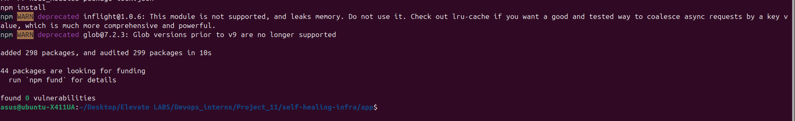
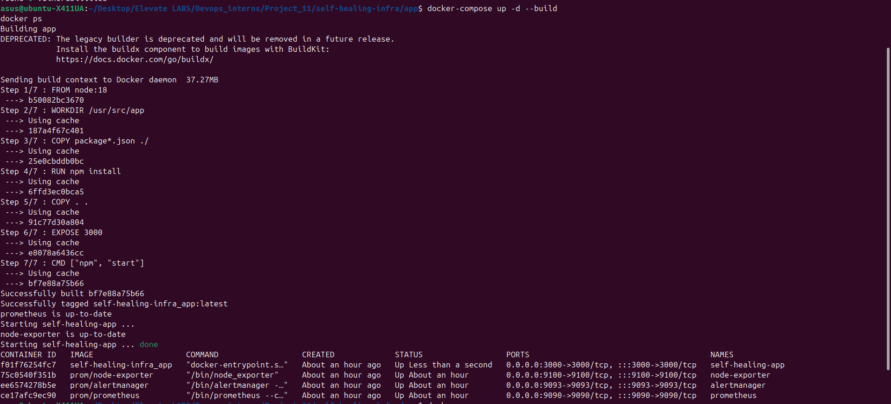
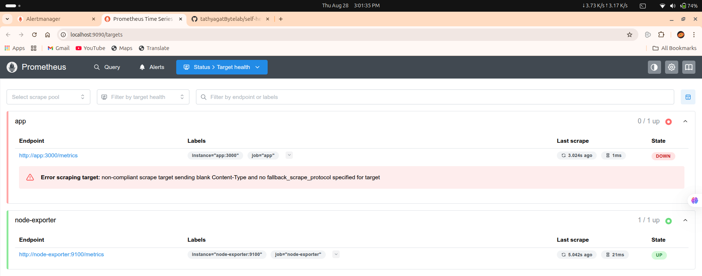
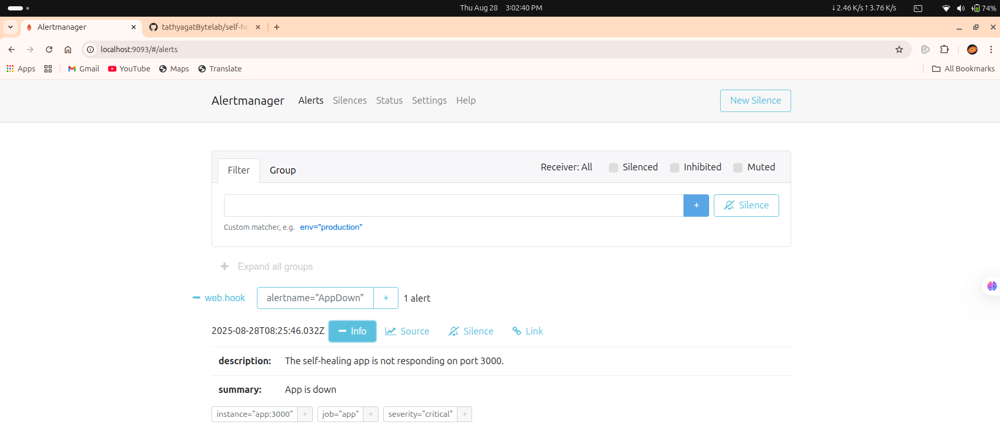
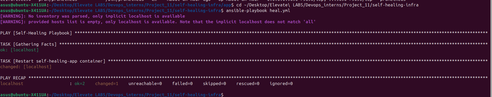
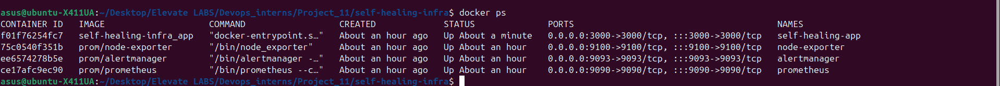

#  Self-Healing Infrastructure with Prometheus, Alertmanager & Ansible

##  Introduction
This project demonstrates **self-healing infrastructure** using a monitoring and automation stack:
- **Prometheus** monitors a Node.js app and system metrics.
- **Alertmanager** fires alerts when the app goes down.
- **Ansible** automatically restarts the container to restore service availability.

This ensures high availability by detecting failures and recovering without manual intervention.

---

## 🛠 Tools & Technologies
- **Docker & Docker Compose** – containerization and orchestration
- **Node.js** – sample application
- **Prometheus** – monitoring
- **Node Exporter** – host system metrics
- **Alertmanager** – alert delivery
- **Ansible** – automated recovery (healing)
- **Python Webhook Server** – bridges Alertmanager → Ansible

---

## 📂 Project Structure
```
self-healing-infra/
├── app/ # Node.js app
│ ├── server.js
│ ├── server.test.js
│ ├── package.json
│ └── Dockerfile
├── prometheus.yml # Prometheus config
├── alert-rules.yml # Alerting rules
├── alert.yml # Alertmanager config
├── docker-compose.yml # Runs app + monitoring stack
├── heal.yml # Ansible playbook (restarts app)
├── webhook.py # Webhook server (triggers Ansible)
├── screenshots/ # Proof of setup
└── README.md
```


---
## ⚙️ Setup Instructions

### 1️⃣  Clone Repo
- git clone https://github.com/<your-username>/self-healing-infra.git
- cd self-healing-infra

### 2️⃣  Start Services
- docker-compose up -d --build
This runs:

Node.js app → http://localhost:3000

Prometheus → http://localhost:9090

Node Exporter → http://localhost:9100/metrics

Alertmanager → http://localhost:9093

### 3️⃣  Run Webhook Listener
python3 webhook.py
This listens on port 5001 for alerts from Alertmanager.

### 4️⃣  Simulate Failure
Stop the app manually:
- docker stop self-healing-app
Prometheus will detect it, Alertmanager will fire an alert, and Ansible will restart the container automatically.

### ## 📸 Screenshots

### 1. NPM Install & Dependencies  
[](https://github.com/tathyagatBytelab/self-healing-infra/blob/main/screenshots/1.png)

### 2. App Running in Docker  
[](https://github.com/tathyagatBytelab/self-healing-infra/blob/main/screenshots/2.png)

### 3. Prometheus Monitoring  
[](https://github.com/tathyagatBytelab/self-healing-infra/blob/main/screenshots/3.png)

### 4. Alertmanager Triggered  
[](https://github.com/tathyagatBytelab/self-healing-infra/blob/main/screenshots/4.png)

### 5. Ansible Healing Log *(placeholder)*  
[](https://github.com/tathyagatBytelab/self-healing-infra/blob/main/screenshots/5.png)

### 6. Container Restored *(placeholder)*  
[](https://github.com/tathyagatBytelab/self-healing-infra/blob/main/screenshots/6.png)
 
